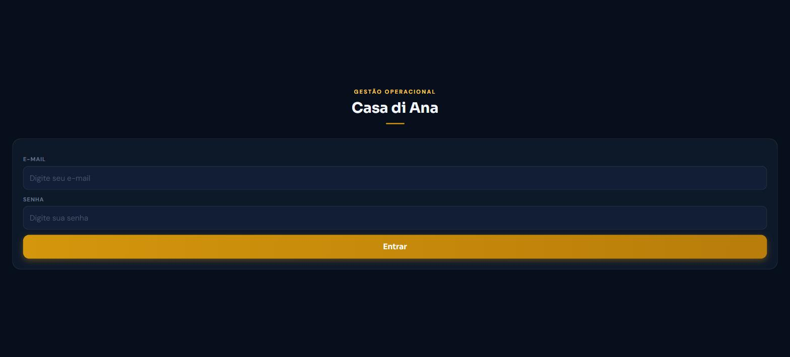
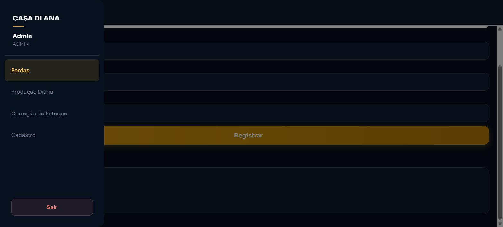
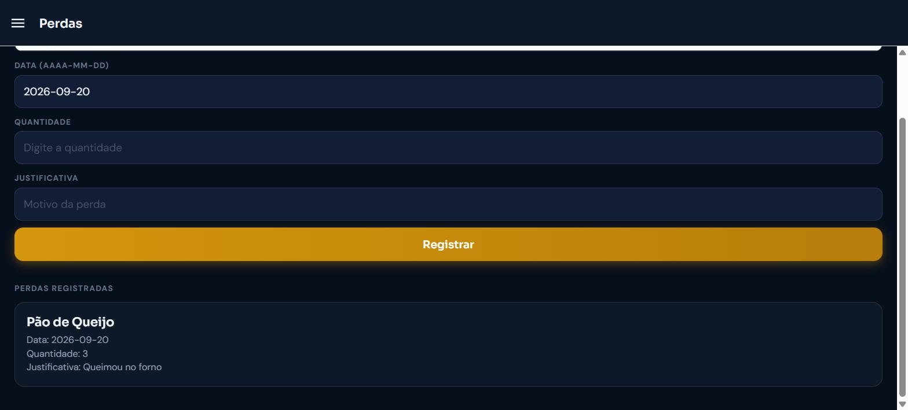
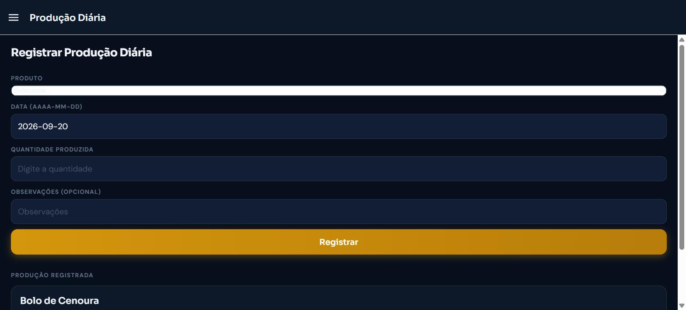
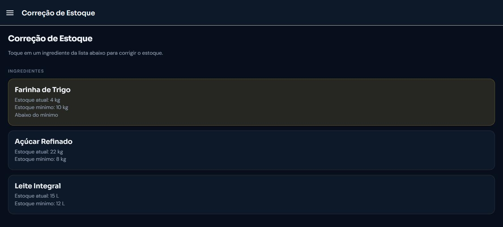
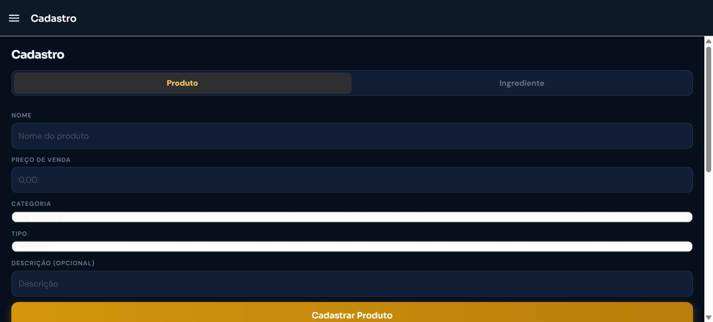
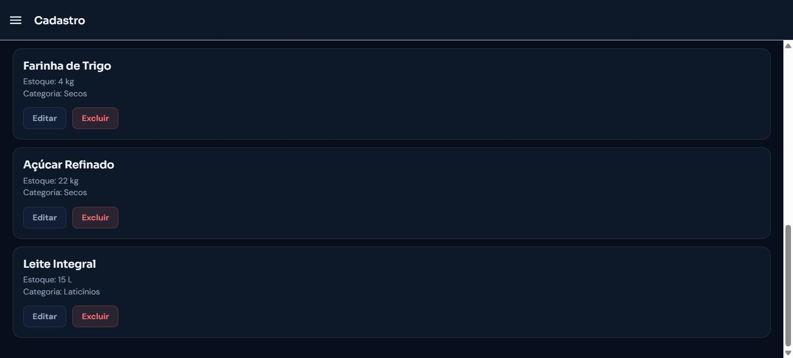

# Casa di Ana Mobile

Aplicativo mobile (Expo / React Native) para o sistema de gestão operacional da cafeteria **Casa di Ana**.

---

## 🎯 Objetivo da aplicação

O sistema de gestão da Casa di Ana já é um ERP completo (estoque, produção, vendas, compras, relatórios), acessado hoje por uma aplicação web. Esse app mobile nasce de uma necessidade real: **os operadores de cozinha, padaria e bar não têm acesso a um computador durante o expediente**, mas precisam registrar perdas, produção e ajustes de estoque no momento em que acontecem.

O objetivo é oferecer um cliente mobile simples que **consome a API REST já existente do sistema** — sem duplicar modelos de dados, regras de negócio ou validações, que continuam centralizadas no backend — permitindo que o operador resolva tarefas do dia a dia direto do celular.

- Repositório do backend consumido: [Projeto_Gestao_Casa_Di_Ana](https://github.com/Gustavoleal1194/Projeto_Gestao_Casa_Di_Ana)
- API em produção: `https://casadiana-api.onrender.com/api`

---

## 🗺️ Funcionalidades previstas para o projeto completo

- Autenticação segura, com suporte à autenticação de dois fatores (2FA), espelhando o fluxo do sistema principal.
- Registro de perdas de produtos.
- Registro de produção diária.
- Correção/ajuste de estoque de ingredientes.
- Cadastro completo (CRUD) de produtos e ingredientes.
- Navegação por menu lateral, com identidade visual alinhada ao sistema web.
- Possíveis extensões futuras, aproveitando endpoints que a API já expõe: registro de vendas diárias, central de notificações de estoque crítico/zerado, consulta de relatórios operacionais.

---

## ✅ Funcionalidades implementadas até o Checkpoint 01

- [x] **Login** com e-mail/senha, consumindo `POST /api/auth/login` da API em produção.
- [x] **Autenticação de dois fatores (2FA)** — fluxo completo de verificação de código via `POST /api/auth/verificar-2fa`, para contas com 2FA habilitado.
- [x] **Sessão persistente** — o token fica salvo no dispositivo; o usuário não precisa logar de novo a cada vez que abre o app.
- [x] **Módulo Perdas** — lista as perdas já registradas e permite registrar uma nova perda de produto (produto, data, quantidade, justificativa).
- [x] **Módulo Produção Diária** — lista a produção registrada e permite registrar produção de um produto (com baixa automática de estoque calculada pela própria API).
- [x] **Módulo Correção de Estoque** — lista os ingredientes (destacando visualmente os que estão abaixo do estoque mínimo) e permite corrigir a quantidade real em estoque de um ingrediente.
- [x] **Módulo Cadastro** — CRUD completo (criar, listar, editar, desativar) de **Produtos** e **Ingredientes**, com seleção de categoria e unidade de medida.
- [x] **Navegação por menu lateral (drawer)**, mostrando nome/papel do usuário logado e opção de logout.
- [x] **Identidade visual** alinhada ao sistema web (paleta em tons de âmbar sobre fundo escuro, tipografia Sora/DM Sans, componentes de card, botão e formulário consistentes).

---

## 🧱 Dificuldades encontradas durante o desenvolvimento

- **CORS ao testar no navegador**: rodar o app em modo web (`expo start --web`) para testes rápidos esbarrava em bloqueio de CORS, já que a API só libera o domínio do frontend web oficial. A solução foi validar as chamadas de API sempre via **Expo Go** em dispositivo real, já que CORS é uma restrição exclusiva de navegador e não existe em runtime nativo.
- **Cold start do plano gratuito do Render**: a API entra em modo de espera quando fica ociosa, e a primeira requisição após um tempo parado pode retornar `503` por alguns segundos até o serviço acordar. Foi necessário aumentar o tempo limite das requisições no app e tratar esse cenário com uma mensagem amigável.

---

## 🔗 Repositórios

- **App mobile (este projeto):** https://github.com/Gustavoleal1194/GestaoCasaDiAna_Mobile
- **Backend / API consumida:** https://github.com/Gustavoleal1194/Projeto_Gestao_Casa_Di_Ana

---

## 📱 Capturas de tela

*Dados exibidos são ilustrativos, para fins de demonstração da interface.*

<table>
  <tr>
    <td align="center">
      <br>
      <sub>Login (com suporte a 2FA)</sub>
    </td>
    <td align="center">
      <br>
      <sub>Menu lateral</sub>
    </td>
  </tr>
  <tr>
    <td align="center">
      <br>
      <sub>Registrar Perda</sub>
    </td>
    <td align="center">
      <br>
      <sub>Produção Diária</sub>
    </td>
  </tr>
  <tr>
    <td align="center">
      <br>
      <sub>Correção de Estoque</sub>
    </td>
    <td align="center">
      <br>
      <sub>Cadastro — Produto</sub>
    </td>
  </tr>
  <tr>
    <td align="center" colspan="2">
      <br>
      <sub>Cadastro — Ingrediente (Editar/Excluir)</sub>
    </td>
  </tr>
</table>

---

## ⚙️ Tecnologias

| Tecnologia | Uso |
|---|---|
| Expo SDK 57 / React Native 0.86 | Framework mobile |
| TypeScript | Tipagem estática |
| React Navigation (Drawer) | Navegação por menu lateral |
| AsyncStorage | Persistência da sessão no dispositivo |
| expo-linear-gradient | Botões com gradiente (identidade visual) |
| @expo-google-fonts (Sora, DM Sans) | Tipografia alinhada ao sistema web |

---

## 🚀 Como executar

```bash
npm install
npx expo start
```

Escaneie o QR code exibido no terminal com o app **Expo Go** (Android/iOS), estando o celular na mesma rede Wi-Fi do computador.

O app já aponta para a API em produção (`https://casadiana-api.onrender.com/api`) — não é necessário rodar o backend localmente para testar.
